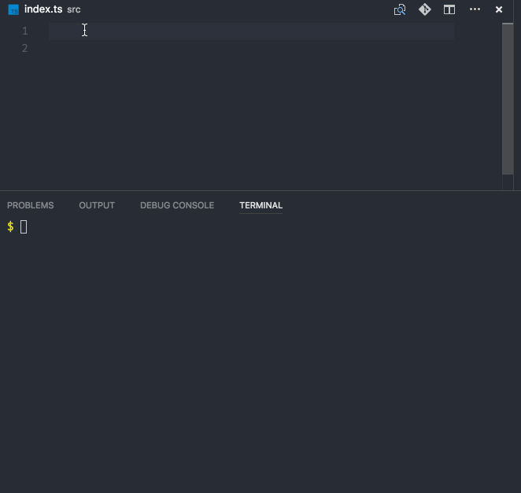

## Introduction

What are we gonna build today ?

- Micro-library called “starwars-names”

What will you learn in this workshop ?

- everything you need to know to create a micro open source library for JavaScript
- set up the GitHub repo,
- publish a module to npm,
- set up a tests with code coverage reporting (using [Jest](https://facebook.github.io/jest/)))
- setup continuous integration
- use latest ecmascript (ES2015) with Typescript,
- configure Webpack, and distribute the library as a "Universal JavaScript" (a.k.a. "Isomorphic JavaScript") module (consumable by both the browser and node).
- use our library in a Typescript project to see benefits of consuming TS libraries

